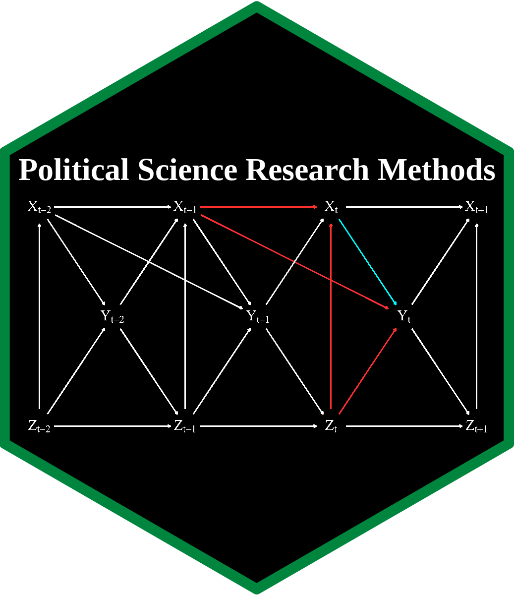

# PSCI 3300 Political Science Research Methods 

[A. Jordan Nafa](https://www.ajordannafa.com/) • [Department of
Political Science](https://politicalscience.unt.edu/) • University of
North Texas

------------------------------------------------------------------------

This github repository is home to the content for my Fall 2022 political
science research methods and causal inference course at the University
of North Texas. The class is taught from a primarily Bayesian
perspective using R, [Stan](https://mc-stan.org/), and
[`{brms}`](https://github.com/paul-buerkner/brms) and focuses heavily on
reproducibility and application rather than math for math’s sake. This
repository will be updated throughout the course of the Fall 2022
semester with lecture materials, tutorials for R, and R scripts to
reproduce each of the articles listed on the course syllabus.

To download the current version of the course content, you can execute
the following command from a desktop terminal

    git clone --recursive https://github.com/ajnafa/psci-3300-political-science-research.git

Due to copyright limitations, PDF versions of the assigned readings for
the course are not provided via github but are available upon request as
is course content tailored to the Canvas LME (i.e., html pages for each
week, screenshots of how I have the course’s Canvas page structured,
etc.).

## Acknowledgments

The content of this class relies in part on materials from courses
designed by [Andrew
Heiss](https://github.com/andrewheiss/evalf22.classes.andrewheiss.com/blob/main/LICENSE.md),
[Matthew](https://github.com/mattblackwell/gov2003-f21-site)
[Blackwell](https://github.com/mattblackwell/gov50-f22-site), and
[Thomas J. Leeper](https://github.com/leeper/designcourse). I thank the
authors for making their instructional materials publicly available.
Acknowledgment here should not be construed as endorsement of any of the
content or materials in this repository.

## Licenses

**Text and figures:** All text and images are licensed under Creative
Commons ([CC-BY-NC
4.0](https://creativecommons.org/licenses/by-nc/4.0/))

**Code:** All code is licensed under the [BSD 3-Clause
License](LICENSE.md).
